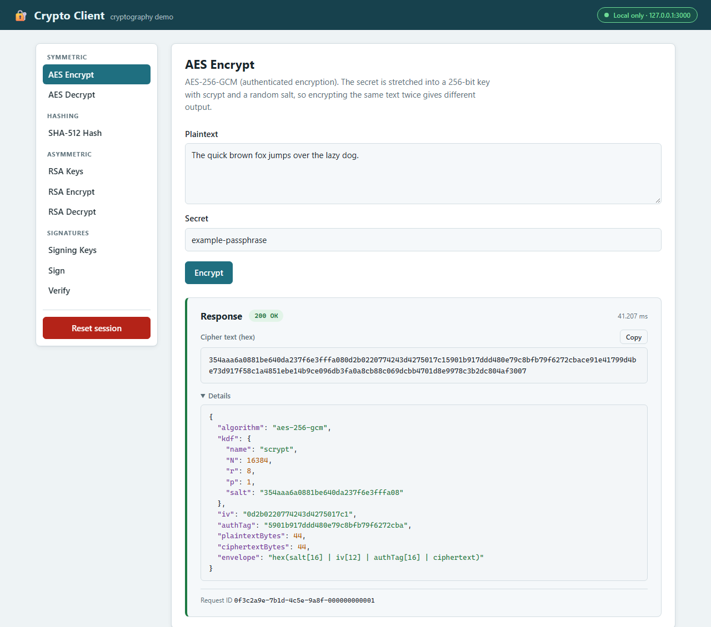
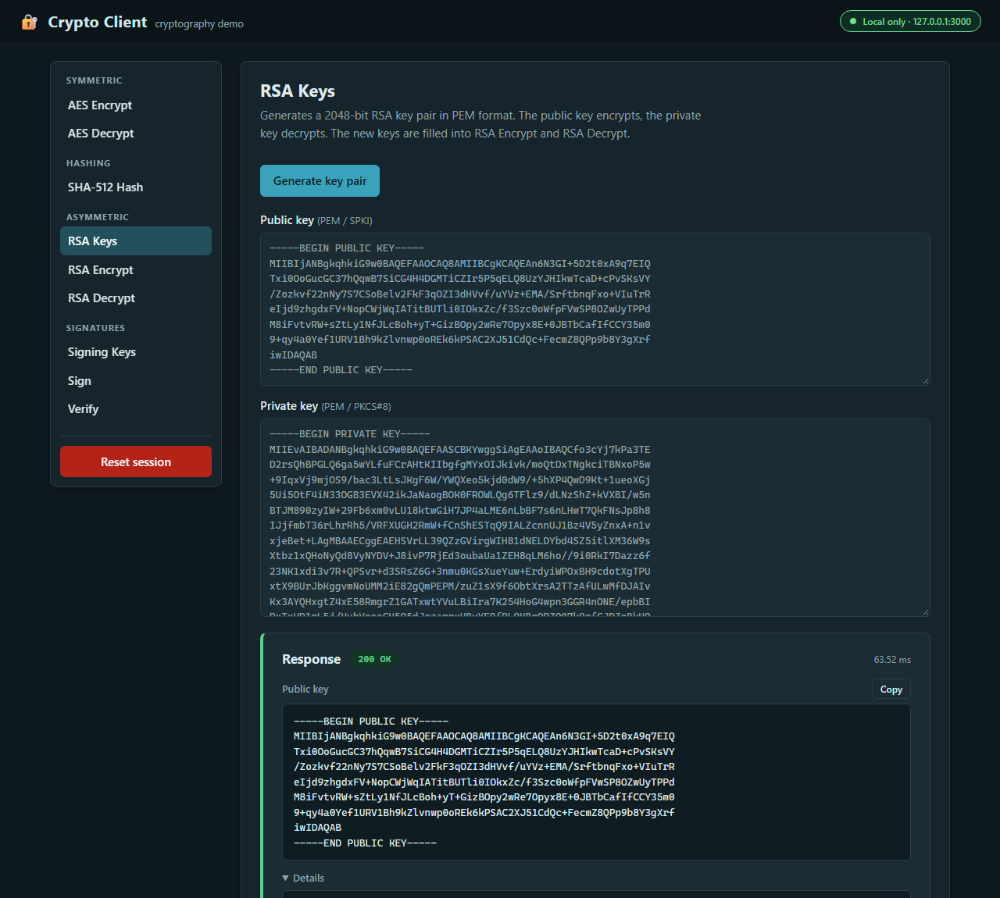
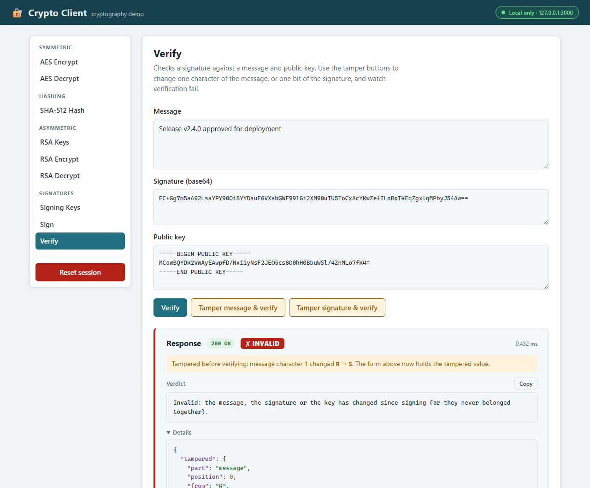
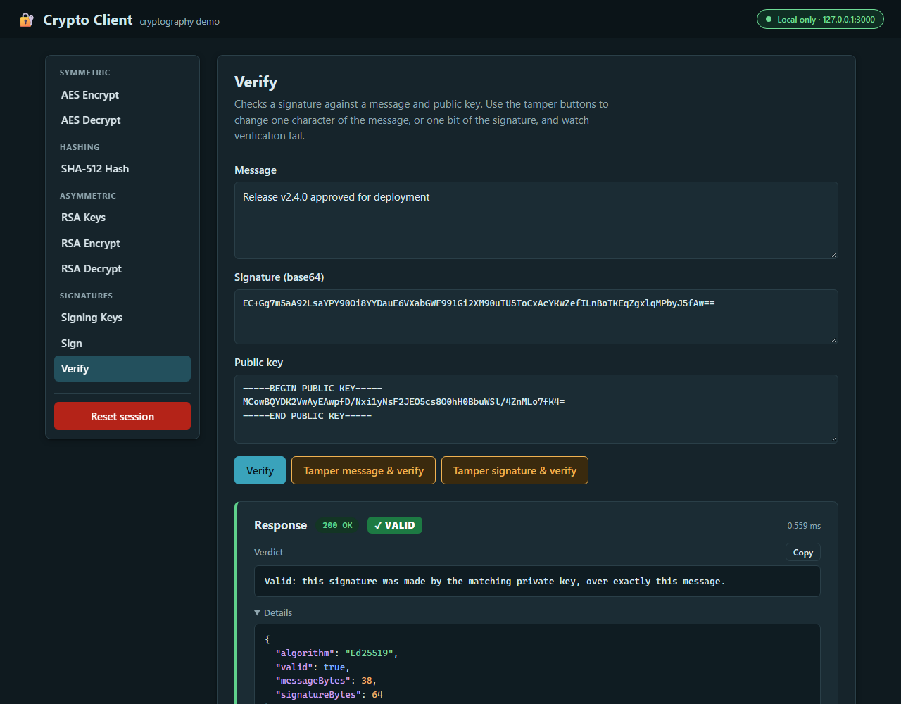
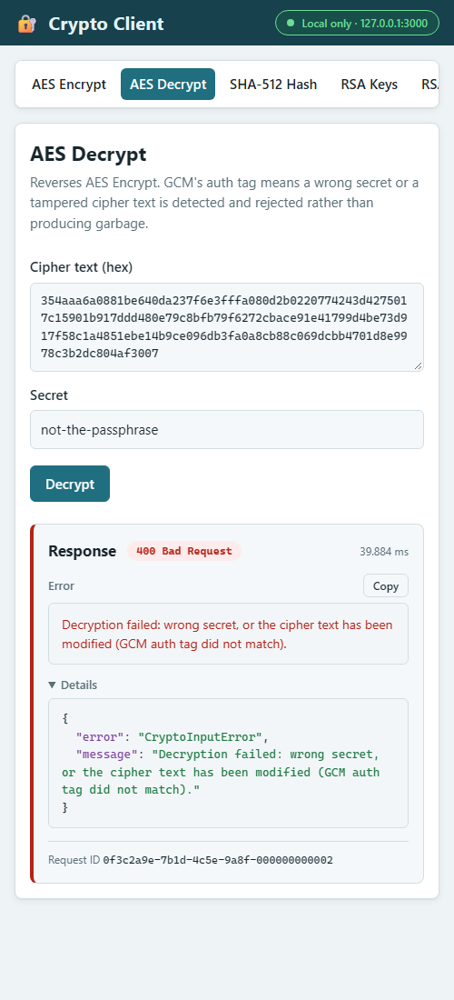
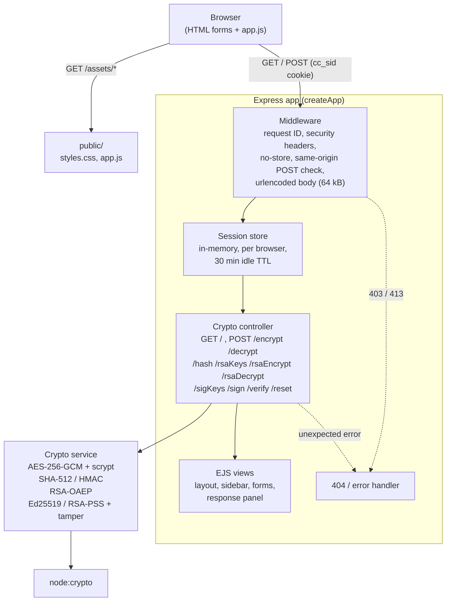
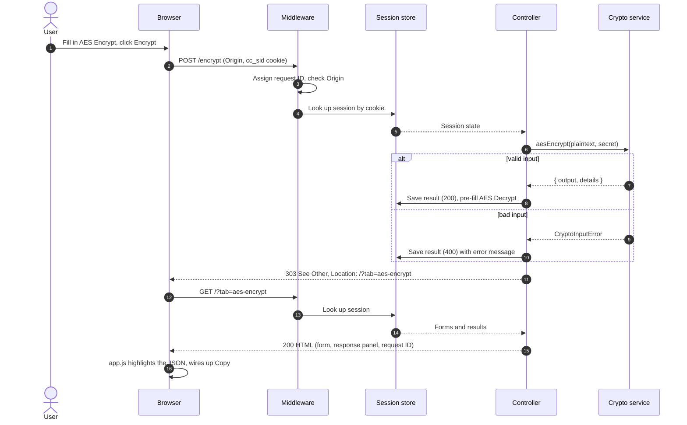

# Crypto Client

A small local web app that demonstrates symmetric encryption, hashing, public-key encryption and digital signatures with Node's built-in `node:crypto` module:

| Operation | Algorithm |
| --- | --- |
| **AES Encrypt / Decrypt** | AES-256-GCM (authenticated). The secret is turned into a key with scrypt and a random salt |
| **SHA-512 Hash** | SHA-512, or HMAC-SHA-512 when a secret is given |
| **RSA Keys** | 2048-bit RSA key pair, PEM encoded (SPKI public, PKCS#8 private) |
| **RSA Encrypt / Decrypt** | RSA-OAEP with SHA-256 |
| **Signing Keys** | Ed25519 key pair, PEM encoded |
| **Sign / Verify** | Ed25519, or RSA-PSS with SHA-256 when given an RSA key. Verify has buttons that tamper with the message or the signature first |

Every operation shows its output, a copy button, and a **Details** panel listing the parameters used (salt, IV, auth tag, key size and so on), so you can see what each algorithm actually produces.



> **Disclaimer.** This is a teaching demo, not a secure tool. The primitives are sound, but the app shows secrets and unencrypted private keys on screen and keeps them in server memory. Don't paste real secrets or production keys into it, and don't use it as reference code for a production system.

## Requirements

- Node.js 20 or later
- No native build tools, cloud accounts or credentials. Everything uses Node's built-in crypto.

## Install and run

```sh
git clone https://github.com/ajyounguk/crypto-client.git
cd crypto-client
npm install
npm start
```

Open <http://127.0.0.1:3000>.

| Environment variable | Default | Meaning |
| --- | --- | --- |
| `HOST` | `127.0.0.1` | Interface to bind. The default is loopback only |
| `PORT` | `3000` | Port to listen on |

The badge at the top right shows who can reach the server:

| Badge | Bind address | Reachable from |
| --- | --- | --- |
| 🟢 **Local only** | `127.0.0.1`, `localhost`, `::1` | This machine only |
| 🟠 **Custom interface** | A specific address, e.g. `192.0.2.10` | Anything that can route to that interface |
| 🔴 **All interfaces** | `0.0.0.0` or `::` | Every network the machine is on |

## Using it

- Pick an operation from the sidebar. On a narrow screen the sidebar becomes a scrolling strip across the top.
- Each submit runs the operation, then redirects back to the page (post/redirect/get), so refreshing never re-submits a form.
- Results chain together: encrypting pre-fills the matching decrypt form, generating keys fills the forms that use them, and signing fills Verify with the message, the signature and the matching public key.
- **Verify** shows a green **✓ VALID** or red **✗ INVALID** verdict. **Tamper message & verify** changes one character of the message (the first letter or digit moves to the next one, so `R` becomes `S`). **Tamper signature & verify** flips one bit in the middle of the signature. Either way the tampered value stays in the form and a note says exactly what changed, so you can see that a one-character edit is enough to break the signature.
- Bad input (wrong secret, tampered cipher text, a malformed key, text too long for RSA) shows a red **400 Bad Request** result that explains what went wrong.
- **Reset session** (red, asks for confirmation) clears everything you've entered or generated. Both **Generate key pair** buttons ask before replacing an existing pair.
- The response panel footer shows the request ID. Unexpected server errors show the same ID, and it matches the server log line.









## Security notes

- **No authentication.** Anyone who can reach the port can use the app. It binds to `127.0.0.1` by default; keep it that way. If you set `HOST=0.0.0.0`, the badge turns red, anyone on your network can use it, and everything travels over plain HTTP.
- **Secrets live in server memory.** Each browser gets a random, `HttpOnly`, `SameSite=Strict` session cookie. Form values, secrets and generated private keys are held in this process's memory for that session only: never written to disk, and gone after 30 minutes idle or a restart. One browser can't see another's data.
- **Cross-site requests.** Every POST is checked: a request whose `Origin` doesn't match the host, or that the browser marks `Sec-Fetch-Site: cross-site`, is rejected with 403. With the `SameSite=Strict` cookie, this stops another website from driving the app through your browser. Clients that send no `Origin` header (e.g. `curl`) are allowed, which is fine for a loopback-only tool.
- **Output handling.** Every value is HTML-escaped when rendered, and the client script builds highlighted output with `textContent`, never `innerHTML`. A Content-Security-Policy allows only same-origin scripts and styles (no inline script). Pages are sent with `Cache-Control: no-store` so secrets don't land in the browser cache.
- **Errors.** Unexpected errors show a generic message and a request ID. The stack trace goes to the server log only.
- **Credentials.** The app uses no cloud services, API keys or credential files, so there is nothing to configure or protect. If you fork it to add a service, load credentials from the platform's standard provider chain or a secrets manager, never from files in the repo.

## Tests

```sh
npm test
```

The suite uses `node:test` and `supertest`. It covers every route (success, input errors and unexpected errors), the post/redirect/get flow and form pre-fills, session isolation and expiry, the cross-site POST check, config loading and the badge, security headers, page structure (no duplicate ids, labels wired to inputs, no inline script), and HTML escaping of hostile input. It also checks the crypto against published test vectors (FIPS 180-2 for SHA-512, RFC 4231 for HMAC), and tests that both kinds of tampering turn a valid signature invalid.

## Project layout

```
app.js                        createApp() factory; listens only when run directly
controllers/cryptoController.js  routes and post/redirect/get handling
lib/cryptoService.js          AES-GCM, SHA-512/HMAC, RSA-OAEP and Ed25519/RSA-PSS signatures over node:crypto
lib/sessionStore.js           in-memory per-browser session store
lib/config.js                 HOST/PORT loading and the bind-address badge
views/                        EJS templates (layout partials + one form per operation)
public/                       stylesheet and client script
test/                         node:test suites
```

## Changes from the original version

The original (2018) app no longer installed or ran: `ursa` is an unmaintained native module that fails to build, and `crypto.createCipher` was removed in Node 22. This version keeps the same six operations, but:

- **AES output format changed.** It now uses AES-256-GCM with an scrypt-derived key, a random salt and a random IV. Before, it used AES-256-CTR with an MD5-derived key and no IV, so identical inputs always gave identical output. Cipher text from the old version can't be decrypted.
- **Hashing with no secret is now plain SHA-512.** It used to be an HMAC with an empty key, labelled as a hash.
- **RSA moved from `ursa` to `node:crypto`.** Keys are standard PEM (they were base64-wrapped PEM), and encryption is OAEP-SHA-256.
- **State is per browser.** It used to be one global object shared by every visitor.
- Bad input returns a clear error instead of crashing the request.

## Acknowledgements

The original was based on Christoph Hartmann's examples at <http://lollyrock.com/articles/nodejs-encryption/>.

## Architecture

Components: the Express app wires up per-request middleware, the session store and the controller. The controller calls the crypto service and renders EJS views.



Request flow: every form submit stores its result in the session, then redirects (post/redirect/get).



## License

MIT, see [LICENSE](LICENSE).
